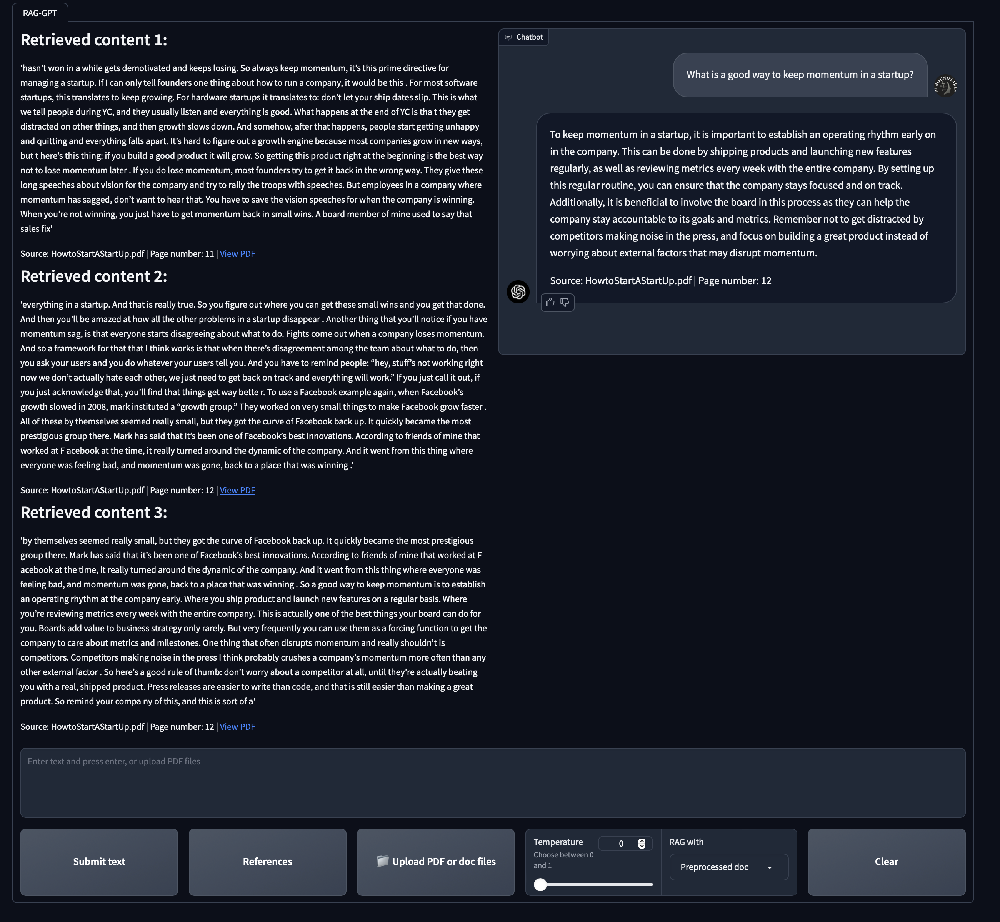

This RAG chatbot offers versatile usage through three different methods:

- Offline Documents: Engage with documents that you've pre-processed and vectorized. These documents can be seamlessly integrated into your chat sessions.
- Real-time Uploads: Easily upload documents during your chat sessions, allowing the chatbot to process and respond to the content on-the-fly.
- Summarization Requests: Request the chatbot to provide a comprehensive summary of an entire PDF or document in a single interaction, streamlining information retrieval.

To employ any of these methods, simply configure the appropriate settings in the "RAG with" dropdown menu within the chatbot interface. Tailor your interactions with documents to suit your preferences and needs efficiently.

The user interface is crafted with gradio, ensuring an intuitive and user-friendly experience.
The model incorporates memory, retaining user Q&As for an enhanced and personalized user experience.
For each response, you can access the retrieved content along with the option to view the corresponding PDF.

## Setup

You will need to sign up for an OpenAI API key and add it to the `.env` file. Then:

```bash
pip install -r requirements.txt
```
and run the app with:
```bash
python src/raggpt_app.py
```

In a seperate terminal, start the web server to host uploaded documents with:
```bash
python src/serve.py
```
